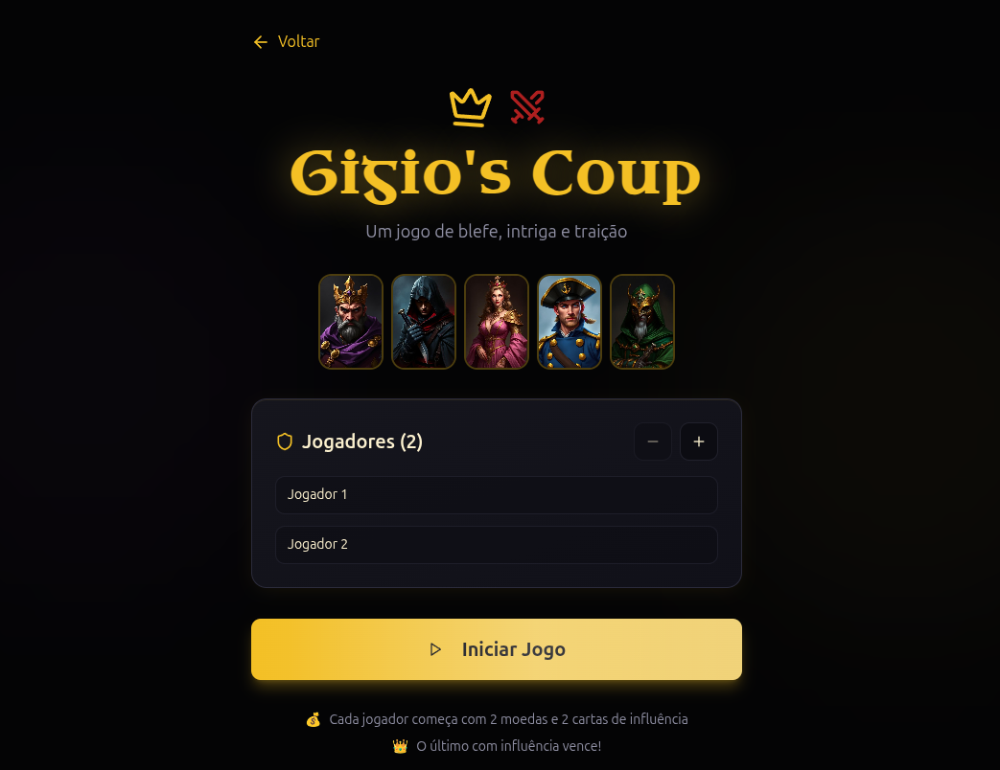

# 🏰 Gigio's Coup - Jogo de Blefe e Estratégia

Bem-vindo ao **Gigio's Coup**, uma implementação digital do clássico jogo de cartas Coup, onde blefe, estratégia e manipulação se encontram em uma experiência web imersiva. Este projeto foi desenvolvido para demonstrar minhas habilidades como desenvolvedor full-stack, combinando um backend robusto com NestJS e um frontend interativo e elegante.

## 🎯 Objetivo do Projeto

O objetivo deste projeto é criar uma versão digital completa do jogo Coup, oferecendo:
- **Modo Offline**: Jogue localmente com amigos no mesmo dispositivo
- **Sistema de Autenticação**: Registro, login e recuperação de senha via email
- **Interface Imersiva**: Design medieval elegante com animações premium
- **Experiência Completa**: Todas as mecânicas do jogo original fielmente implementadas

## 🎮 Como Funciona o Jogo

### Objetivo
Em **Coup**, o objetivo é ser o último jogador com influência, eliminando as cartas (influências) dos oponentes por meio de **blefe, manipulação e uso estratégico** das habilidades dos personagens.

### Preparação
- Cada jogador recebe **2 moedas** e **2 cartas de personagem** (influência) viradas para baixo
- O baralho de **15 cartas** (3 cópias de cada um dos 5 personagens) fica no centro
- Jogadores jogam em **sentido horário**

### Personagens e Habilidades

| Personagem | Habilidade Principal | Bloqueio |
|------------|---------------------|----------|
| 👑 **Duque** | Pega 3 moedas (Taxação) | Bloqueia Ajuda Externa |
| 🗡️ **Assassino** | Paga 3 moedas para assassinar | - |
| 💎 **Condessa** | - | Bloqueia Assassinato |
| 🛡️ **Capitão** | Rouba 2 moedas | Bloqueia Roubo |
| 🎭 **Embaixador** | Troca cartas com o baralho | Bloqueia Roubo |

### Ações do Turno

**Ações Básicas** (qualquer jogador pode fazer):
- **Renda**: Pegue 1 moeda (não pode ser bloqueada)
- **Ajuda Externa**: Pegue 2 moedas (pode ser bloqueada pelo Duque)
- **Golpe de Estado**: Pague 7 moedas para forçar outro jogador a perder uma influência
  - ⚠️ Se tiver 10+ moedas, é **obrigado** a fazer Golpe de Estado

**Ações de Personagem** (pode blefar):
- **Duque**: Pega 3 moedas (Taxação)
- **Assassino**: Paga 3 moedas para assassinar um jogador
- **Capitão**: Rouba 2 moedas de outro jogador
- **Embaixador**: Troca suas cartas com o baralho

### Desafios e Bloqueios

**🎭 Desafio**: Questione se o jogador realmente tem a carta que alegou possuir
- ✅ **Desafio bem-sucedido** (jogador blefou): O blefador perde 1 influência
- ❌ **Desafio falhou** (jogador tinha a carta): Quem desafiou perde 1 influência

**🛡️ Bloqueio**: Use um personagem para bloquear a ação de outro jogador
- Bloqueios também podem ser desafiados!

### Fim do Jogo
O último jogador com pelo menos **uma carta de influência** (virada para baixo) **vence o jogo**! 🏆

## 💡 Abordagem de Design

Neste projeto, utilizei princípios de design centrado no usuário, focando em:

- **Navegação Intuitiva**: Interface clara e fácil de navegar para jogadores de todos os níveis
- **Animações Premium**: Implementação de animações suaves com GSAP e Framer Motion para transições elegantes
- **Estética Medieval**: Design sofisticado inspirado em cortes reais, com paleta de cores douradas e elementos temáticos
- **Feedback Visual**: Cada ação do jogo possui feedback visual claro e imediato
- **Responsividade**: Interface adaptável para desktop, tablet e mobile

## ⚙️ Tecnologias Utilizadas

### Frontend
- **React 18**: Biblioteca JavaScript moderna para construção de interfaces
- **TypeScript**: Tipagem estática para código mais seguro e manutenível
- **Vite**: Build tool ultra-rápida para desenvolvimento
- **Framer Motion**: Animações declarativas e fluidas
- **GSAP**: Animações de alta performance para efeitos sofisticados
- **Tailwind CSS**: Framework CSS utility-first para estilização rápida
- **Shadcn/ui**: Componentes UI modernos e acessíveis
- **React Router**: Navegação entre páginas

### Backend
- **NestJS**: Framework Node.js progressivo para aplicações server-side
- **Bun**: Runtime JavaScript/TypeScript ultra-rápido
- **Prisma**: ORM moderno para TypeScript e Node.js
- **PostgreSQL**: Banco de dados relacional (via NeonDB)
- **JWT**: Autenticação segura com JSON Web Tokens
- **Nodemailer**: Envio de emails via SMTP
- **Bcrypt**: Hash de senhas seguro

### DevOps
- **Docker**: Containerização de serviços
- **Docker Compose**: Orquestração de múltiplos containers
- **Nginx**: Servidor web para frontend em produção

## 🌐 Funcionalidades

### 🎮 Jogo
- ✨ Modo offline para 2-6 jogadores
- 🎯 Todas as mecânicas do Coup implementadas
- 🎭 Sistema de blefe e desafios
- 🛡️ Bloqueios e contra-bloqueios
- 📊 Log detalhado de ações
- 🎨 Cartas de personagens com design único
- 🔄 Transições suaves entre turnos

### 🔐 Autenticação
- 📝 Registro de usuários com validação
- 🔑 Login seguro com JWT
- 📧 Recuperação de senha via email
- 👤 Perfil de usuário
- 🔒 Rotas protegidas

### 🎨 Interface
- 🌙 Design medieval elegante
- ✨ Animações premium em toda a experiência
- 📱 Totalmente responsivo
- 🎯 Feedback visual para todas as ações
- 🎭 Efeitos de parallax e máscaras

## 📸 Imagens do Projeto



## ⚙️ Como Executar o Projeto

### Pré-requisitos
- Docker e Docker Compose instalados
- Bun instalado (opcional, para desenvolvimento local)
- Conta Gmail com senha de aplicativo (para envio de emails)

### Com Docker (Recomendado)

1. Clone o repositório:
```bash
git clone https://github.com/geovanigcs/Gigio-s-Coup.git
cd Gigio-s-Coup
```

2. Configure as variáveis de ambiente:
```bash
cp .env.example .env
# Edite o .env com suas configurações
```

3. Configure o email SMTP no `.env`:
```env
SMTP_HOST="smtp.gmail.com"
SMTP_PORT="587"
SMTP_USER="seu-email@gmail.com"
SMTP_PASS="sua-senha-de-aplicativo"
EMAIL_FROM="Gigio's Coup <seu-email@gmail.com>"
```

4. Inicie os containers:
```bash
docker-compose up -d
```

5. Acesse o projeto:
- **Frontend**: http://localhost:8080
- **API**: http://localhost:3001/api

### Desenvolvimento Local

1. Instale as dependências do frontend:
```bash
bun install
```

2. Instale as dependências do backend:
```bash
cd server && bun install
```

3. Execute as migrações do banco de dados:
```bash
bunx prisma migrate dev
```

4. Inicie o backend:
```bash
bun run server
```

5. Em outro terminal, inicie o frontend:
```bash
bun run dev
```

## 🎯 Estrutura do Projeto

```
courtly-influence-clash/
├── src/                      # Frontend React
│   ├── components/          # Componentes reutilizáveis
│   │   ├── game/           # Componentes específicos do jogo
│   │   └── ui/             # Componentes UI (shadcn)
│   ├── contexts/           # Context API (Auth)
│   ├── hooks/              # Hooks customizados
│   ├── lib/                # Utilitários e API client
│   ├── pages/              # Páginas da aplicação
│   └── types/              # Definições TypeScript
├── server/                  # Backend NestJS
│   └── src/
│       ├── auth/           # Módulo de autenticação
│       ├── users/          # Módulo de usuários
│       ├── game/           # Módulo de histórico de jogos
│       ├── friends/        # Módulo de amigos
│       └── common/         # Serviços compartilhados
├── prisma/                 # Schema e migrations do banco
├── docker-compose.yml      # Orquestração de containers
└── Dockerfile.*           # Dockerfiles para cada serviço
```

## 🗺️ Roadmap

- [x] Sistema de autenticação completo
- [x] Jogo offline funcional
- [x] Recuperação de senha via email
- [ ] Sistema de amigos
- [ ] Histórico de partidas
- [ ] Modo online multiplayer (WebSocket)
- [ ] Página de instruções interativa
- [ ] Sistema de ranking
- [ ] Achievements e conquistas

## 🤝 Contribuição

Contribuições são bem-vindas! Se você deseja contribuir, siga estas etapas:

1. **Fork o repositório**
2. **Crie uma nova branch** (`git checkout -b feature/nova-funcionalidade`)
3. **Faça suas alterações e commit** (`git commit -m 'Adiciona nova funcionalidade'`)
4. **Envie para o repositório remoto** (`git push origin feature/nova-funcionalidade`)
5. **Abra um Pull Request**

## 📄 Licença

Este projeto está sob a licença MIT. Veja o arquivo [LICENSE](LICENSE) para mais detalhes.

## 📞 Contato

Para dúvidas ou sugestões, você pode entrar em contato através de:

- **Email**: geovanigcs.dev@gmail.com
- **LinkedIn**: [Geovani Cordeiro](https://www.linkedin.com/in/geovani-cordeiro/)
- **GitHub**: [geovanigcs](https://github.com/geovanigcs)
- **Portfolio**: [geovanidev.online](https://geovanidev.online/)

---

Agradeço por visitar o Gigio's Coup! Que as melhores estratégias vençam! 🏰🎭🗡️
